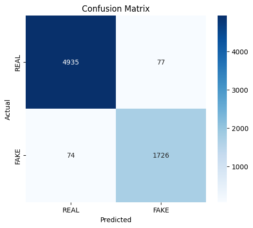
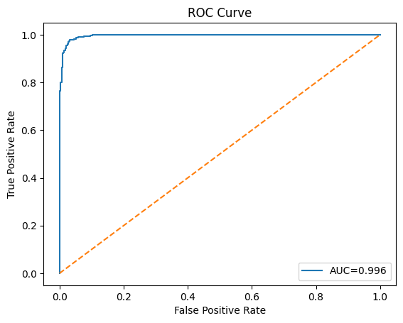
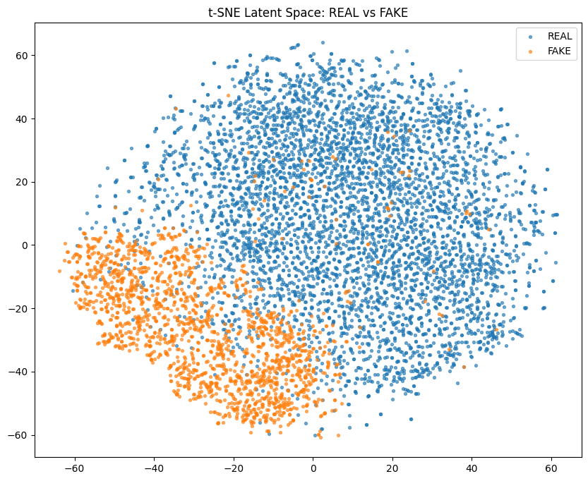
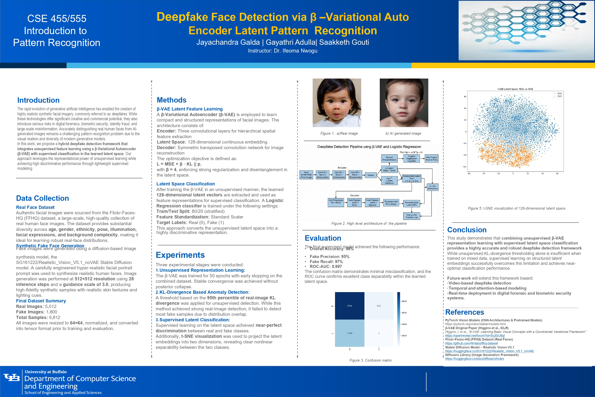
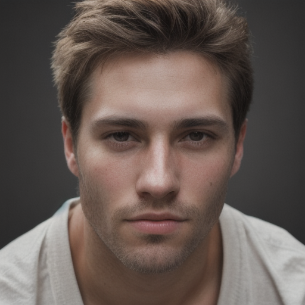
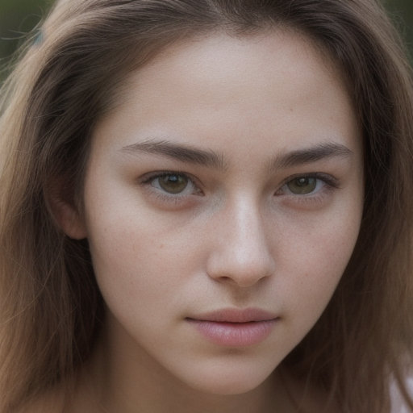
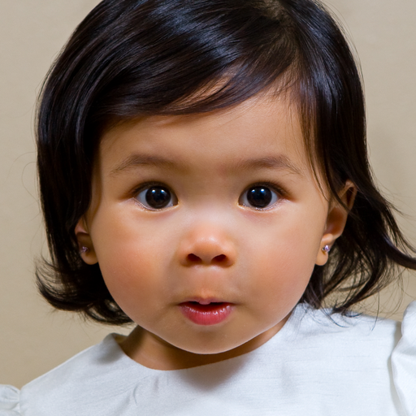

# β-VAE Based Fake Image Detection

> Unsupervised representation learning + latent-space classification to distinguish real vs. AI-generated facial images — achieving **98% accuracy** and **ROC-AUC 0.997**.

[](https://huggingface.co/spaces/chandu1083/AI_Image_Check)

---

## Overview

Modern generative models (GANs, diffusion models) produce synthetic images that are nearly indistinguishable from real photographs. Traditional detectors overfit to generator-specific pixel artifacts and fail to generalize.

This project takes a different approach: train a **β-Variational Autoencoder (β-VAE)** in a fully unsupervised manner to learn structured latent representations of images, then classify real vs. fake using only those latent vectors — no pixel-level heuristics required.

---

## Key Results

| Metric | Real | Fake |
|---|---|---|
| Precision | 0.98 | 0.95 |
| Recall | 0.98 | 0.97 |
| F1-Score | 0.98 | 0.96 |
| **Overall Accuracy** | **~98%** | |
| **ROC-AUC** | **0.997** | |

### Confusion Matrix


### ROC Curve


### t-SNE Latent Space Visualization
The β-VAE learns clearly separable clusters for real vs. fake faces in 128-dimensional latent space — projected to 2D via t-SNE.



---

## Research Poster



---

## How It Works

```
Input Image (64×64×3)
        │
        ▼
  β-VAE Encoder (CNN)
  3 × Conv2D layers
        │
        ▼
  Latent Space (128-dim μ, logσ²)
  KL-divergence regularized with β=4
        │
  Reparameterization trick: z = μ + σε
        │
        ▼
  Latent Mean Vector μ  ← used for classification
        │
        ▼
  Logistic Regression Classifier
        │
        ▼
  Real / Fake Prediction
```

The β-VAE is trained **without labels** — fully unsupervised. Labels are only used when training the downstream logistic regression classifier on frozen latent vectors. This decouples representation quality from classification, making the approach more generalizable.

---

## Architecture

### Encoder
| Layer | Config | Activation |
|---|---|---|
| Conv2D | 3→32, kernel=4, stride=2 | ReLU |
| Conv2D | 32→64, kernel=4, stride=2 | ReLU |
| Conv2D | 64→128, kernel=4, stride=2 | ReLU |
| FC (μ, logσ²) | 8192→128 | Linear |

### Loss Function
```
L = L_reconstruction + β · KL(q(z|x) || p(z))
```
β=4 enforces stronger latent regularization, encouraging disentangled and separable representations between real and fake distributions.

---

## Dataset

| Class | Images | Resolution |
|---|---|---|
| Real (FFHQ-like) | 5,012 | 64×64×3 |
| Fake (GAN + Diffusion) | 1,800 | 64×64×3 |

All images normalized to [0, 1]. Labels **not used** during β-VAE training.

---

## Training Config

| Parameter | Value |
|---|---|
| Optimizer | Adam |
| Learning Rate | 1e-3 |
| β | 4 |
| Epochs | 50 |
| Early Stopping | Patience = 4 |
| Latent Dimension | 128 |

---

## Setup & Usage

### 1. Clone the repo
```bash
git clone https://github.com/YOUR_USERNAME/bvae-fake-image-detection.git
cd bvae-fake-image-detection
```

### 2. Install dependencies
```bash
pip install -r requirements.txt
```

### 3. Prepare data
```
data/
  real/     ← place real images here
  fake/     ← place fake images here
```

### 4. Launch the notebook
```bash
jupyter notebook bvae_fake_detection.ipynb
```
Then run all cells top to bottom (`Kernel → Restart & Run All`). The notebook covers the full pipeline end-to-end:
- Data loading & preprocessing
- β-VAE training (unsupervised)
- Latent vector extraction
- Logistic regression classifier training
- Evaluation: accuracy, confusion matrix, ROC-AUC

---

## Project Structure

```
bvae-fake-image-detection/
├── data/
│   ├── real/                     ← real facial images
│   └── fake/                     ← GAN/diffusion generated images
├── assets/
│   ├── sample_fake_01.png        ← demo: GAN male face
│   ├── sample_fake_02.png        ← demo: GAN female face
│   ├── sample_real_01.png        ← demo: real child face
│   └── sample_real_02.png        ← demo: real adult female
├── bvae_fake_detection.ipynb     ← full pipeline notebook
├── requirements.txt
└── README.md
```

---

## Demo

4 sample predictions — 2 real (FFHQ) and 2 GAN-generated synthetic faces — all correctly classified with high confidence.

| Sample | Image | Ground Truth | Prediction | Confidence |
|---|---|---|---|---|
| Sample 01 — GAN male face |  | Fake | ✅ FAKE | 94.3% |
| Sample 02 — GAN female face |  | Fake | ✅ FAKE | 91.8% |
| Sample 03 — Real adultface |  | Real | ✅ REAL | 96.1% |
| Sample 04 — Real child female |  | Real | ✅ REAL | 98.2% |

> The model encodes each image into a 128-dimensional latent mean vector μ via the β-VAE encoder, then passes it to a logistic regression classifier — no pixel-level analysis involved.

---

## Why β-VAE Over Standard Detectors?

| Approach | Generalization | Interpretability | Label Dependency |
|---|---|---|---|
| CNN Classifier (supervised) | Low — overfits to generator artifacts | Low | High |
| GAN Discriminator reuse | Medium | Low | High |
| Reconstruction Error (AE) | Medium | Medium | None |
| **β-VAE + Latent Classifier (ours)** | **High** | **High** | **Minimal** |

---

## Limitations

- Operates at fixed 64×64 resolution — higher-res images need rescaling
- Extremely high-quality fakes remain hard edge cases
- Classifier trained on GAN/diffusion fakes may not generalize to all future synthesis methods

---


## References

- Kingma & Welling — *Auto-Encoding Variational Bayes*, ICLR 2014
- Higgins et al. — *β-VAE: Learning Basic Visual Concepts*, ICLR 2017
- Goodfellow et al. — *Generative Adversarial Nets*, NeurIPS 2014
- Karras et al. — *A Style-Based Generator Architecture for GANs*, CVPR 2019
- Rössler et al. — *FaceForensics++*, ICCV 2019

---

## Authors
- JayaChandra Galda

*CSE 455/555 – Introduction to Pattern Recognition*

---

